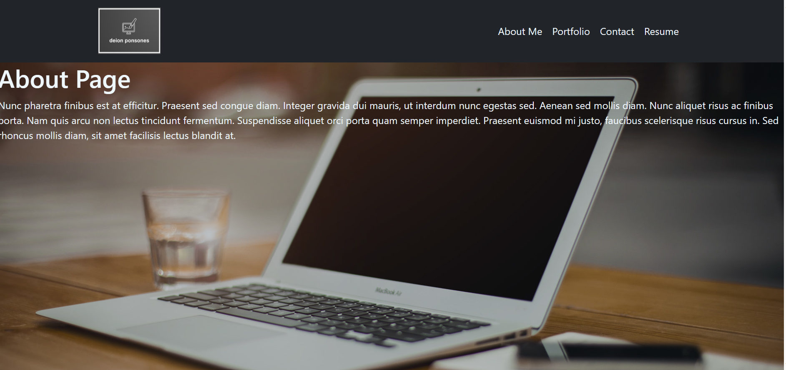

# 

## Description

Portfolio using React! Application features an About, portfolio, contact, and resume page. Cards in the portfolio page redirect to github account. Footer has additional links for contact. 

## Table of Contents

- [Installation](#installation)
- [Usage](#usage)
- [License](#license)
- [Questions](#questions)

## Installation

run 
```
npm i
```
## Screenshots



## Usage

Use contact portions or footer to reach me for addtional information

## License

This project is licensed under the [MIT](https://opensource.org/licenses/MIT) license.

## Questions

If you have any questions or issues, please contact me directly:

- GitHub: [dponsones](https://github.com/dponsones)
- Email: dcponson@gmail.com
